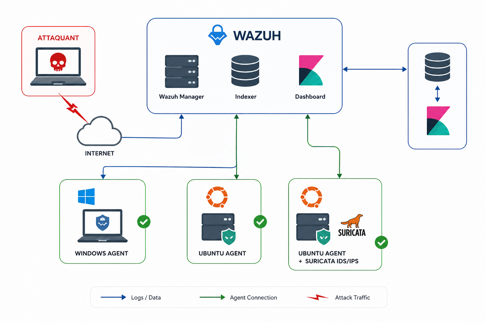

# 🛡️ SIEM Lab — Wazuh Integration (Windows & Ubuntu Agents)

> SIEM laboratory project deploying **Wazuh** (Manager, Indexer, Dashboard) with **Windows Server** and **Ubuntu Server** agents, coupled with **Suricata IDS/IPS** and **Sysmon**, for detecting common threats (brute force, Shellshock, unauthorized processes, malicious commands) and automated active response.

---

## 📌 Project Objective

Set up a complete SIEM environment to:

- Centralize logs from multiple sources (Windows, Linux, IDS/IPS) into Wazuh;
- Detect simulated real-world attacks (SSH/RDP brute force, Shellshock, execution of malicious commands, unauthorized processes);
- Trigger automated responses (**Active Response**) to block an attacker;
- Enrich detection with **Sysmon** (advanced Windows telemetry), **Snort/Suricata** (network IDS/IPS), and **VirusTotal** (file reputation/IOCs);
- Create custom detection rules and tailored dashboards for the lab environment;
- Manage access with a **read-only dashboard user**.

## 🏗️ Architecture



The architecture is based on:

- **Wazuh Manager**: Collects, analyzes, and correlates events;
- **Wazuh Indexer**: Stores and indexes data (OpenSearch);
- **Wazuh Dashboard**: Visualization, search capabilities, and custom dashboards;
- **Windows Agent**: Wazuh agent installed on a Windows Server, coupled with Sysmon;
- **Ubuntu Agent (1)**: Wazuh agent on a standard Ubuntu server;
- **Ubuntu Agent (2) + Suricata IDS/IPS**: Exposed Ubuntu server acting as a network probe, forwarding Suricata alerts to Wazuh;
- **Attacker**: External machine simulating attacks (brute force, Shellshock exploitation, network scans, etc.) over the Internet.

---

## 🧪 Implemented Scenarios

| #   | Scenario                                            | Status |
| --- | --------------------------------------------------- | ------ |
| 1   | Wazuh Manager + Indexer + Dashboard Installation    | ✅     |
| 2   | Agent Installation and Enrollment (Windows, Ubuntu) | ✅     |
| 3   | File Integrity Monitoring (FIM)                     | ✅     |
| 4   | Brute Force Attack Detection (SSH/RDP)              | ✅     |
| 5   | Shellshock Detection (CVE-2014-6271)                | ✅     |
| 6   | Unauthorized Process Detection                      | ✅     |
| 7   | Malicious Command Execution Monitoring              | ✅     |
| 8   | Active Response — Automatic SSH Blocking            | ✅     |
| 9   | Read-Only Dashboard User                            | ✅     |
| 10  | Custom Dashboard                                    | ✅     |
| 11  | Sysmon + Wazuh Integration (Advanced Windows SIEM)  | ✅     |
| 12  | Snort + Wazuh Integration                           | ✅     |
| 13  | Suricata IDS/IPS + Wazuh Integration                | ✅     |
| 14  | Custom Detection Rules                              | ✅     |
| 15  | Wazuh + VirusTotal Integration                      | ✅     |

---

## ⚙️ 1. Installation

### a. Wazuh Manager (Central Server)

```bash
curl -sO [https://packages.wazuh.com/4.x/wazuh-install.sh](https://packages.wazuh.com/4.x/wazuh-install.sh)
sudo bash wazuh-install.sh -a

```

At the end of the installation, the dashboard access URL and generated credentials (user `admin`) will be displayed — **change them immediately** and never commit them in plain text to the repository.

```
Web UI: https://<wazuh-dashboard-ip>:443

```

_Wazuh dashboard showing active enrolled endpoints._

### b. Ubuntu Agent

```bash
apt update
apt install wget -y
wget [https://packages.wazuh.com/4.x/apt/pool/main/w/wazuh-agent/wazuh-agent_4.7.2-1_amd64.deb](https://packages.wazuh.com/4.x/apt/pool/main/w/wazuh-agent/wazuh-agent_4.7.2-1_amd64.deb)
apt install -f -y
apt install lsb-release -y
WAZUH_MANAGER='<MANAGER_IP>' dpkg -i wazuh-agent_4.7.2-1_amd64.deb

```

Or via manual configuration in `/var/ossec/etc/ossec.conf`:

```xml
<client>
  <server>
    <address>MANAGER_IP</address>
    <port>1514</port>
    <protocol>tcp</protocol>
  </server>
</client>

```

```bash
/var/ossec/bin/wazuh-control start
/var/ossec/bin/wazuh-control status

```

### c. Windows Agent

Installation via the graphical wizard `wazuh-agent.msi` or via command line (`msiexec`), filling in the Manager's IP. Verify the status is `Running` in the Windows agent manager.

### d. Starting the Services

```bash
systemctl start wazuh-manager
systemctl start wazuh-indexer
systemctl start wazuh-dashboard

```

📄 Detailed Configurations: [`configs/wazuh-manager/`](https://www.google.com/search?q=configs/wazuh-manager/), [`configs/wazuh-agent-windows/`](https://www.google.com/search?q=configs/wazuh-agent-windows/), [`configs/wazuh-agent-ubuntu/`](https://www.google.com/search?q=configs/wazuh-agent-ubuntu/)

---

## 🗂️ 2. File Integrity Monitoring (FIM)

Real-time monitoring of a sensitive directory on the Windows agent:

```xml
<syscheck>
  <directories recursion_level="0" restrict="winrm.vbs$">%WINDIR%\SysNative</directories>
  <directories check_all="yes" realtime="yes">C:\Users\Administrator\Desktop\SensitiveData</directories>
</syscheck>

```

- `check_all="yes"`: Monitors all file attributes (hash, permissions, owner, size...);
- `realtime="yes"`: Immediate detection (instead of a periodic scan).

Any file creation/modification/deletion inside `SensitiveData` triggers a Wazuh alert visible in the **Integrity Monitoring** dashboard module.

_FIM alert triggered following the modification of a monitored test file._

---

## 🔐 3. Brute Force Attack Detection

Simulation of an SSH (Ubuntu) / RDP (Windows) brute force attack from the attacker machine (e.g., using `hydra` or `crowbar`).

Wazuh detects repeated failed authentication attempts via default rules (`authentication_failed`, `multiple_authentication_failures` groups) and triggers a high-severity alert once the threshold is reached.

_"Multiple authentication failures" alert showing the attacker's source IP address._

---

## 🐚 4. Shellshock Detection (CVE-2014-6271)

Detection of Shellshock vulnerability exploitation attempts through Apache/CGI logs, relying on dedicated Wazuh rules (decoder `web-accesslog` + rule matching the `() { :; };` signature).

_Shellshock alert generated during an HTTP request containing the malicious payload signature._

---

## 🕵️ 5. Unauthorized Process Detection

Leveraging Wazuh's process monitoring capabilities (via Sysmon on Windows or `auditd`/custom rules on Linux) to generate an alert when a non-whitelisted binary is launched (e.g., `nc.exe`, `mimikatz.exe`, `powershell -enc`).

_Alert triggered for an unauthorized listening network tool process._

---

## 💻 6. Malicious Command Execution Monitoring

Detection of suspicious commands executed on hosts (e.g., remote downloads via `curl`/`wget`/`certutil`, enumeration scripts, defense evasion) using rules correlating Sysmon logs (Event ID 1 — process creation) with associated Wazuh rules.

_Telemetry capturing malicious commands and system changes inside the log events._

---

## 🚫 7. Active Response — Automatic SSH Blocking

Configuration of an active response that automatically blocks the source IP address upon detecting an SSH brute force attack, utilizing Wazuh's `firewall-drop` script.

Manager `ossec.conf` excerpt:

```xml
<active-response>
  <command>firewall-drop</command>
  <location>local</location>
  <rules_id>5763,5720</rules_id>
  <timeout>600</timeout>
</active-response>

```

Script used: [`scripts/active-response-ssh-block.sh`](https://www.google.com/search?q=scripts/active-response-ssh-block.sh)

_Source IP automatically blocked via local firewall mechanisms after triggering brute-force thresholds._

---

## 👤 8. Read-Only Dashboard User

Creation of a custom role within the Wazuh Dashboard (OpenSearch Security) restricting permissions to read-only (`readonly`), without rights to modify rules, agents, or configurations — ideal for providing visibility to stakeholders without risk.

_Configured permissions restricting a user account exclusively to the visualization dashboard._

---

## 📊 9. Custom Dashboard

Building a tailored Wazuh dashboard (OpenSearch visualizations) gathering key lab performance metrics: number of alerts per agent, top triggered rules, geographic mapping of attacking IPs, and timelines for critical events.

_The custom monitoring interface showing attack logs and security compliance indicators at a glance._

---

## 🪟 10. Sysmon + SIEM Integration

Deployment of **Sysmon** on the Windows agent with an advanced configuration (e.g., SwiftOnSecurity base), allowing Wazuh to collect granular system telemetry (process creation, network connections, registry modifications, DLL loading) through a `<localfile>` module pointing to the `Microsoft-Windows-Sysmon/Operational` channel.

Configuration: [`configs/sysmon/sysmon-config.xml`](https://www.google.com/search?q=configs/sysmon/sysmon-config.xml)

---

## 🐷 11. Snort + Wazuh Integration

Deployment of **Snort** as a network IDS sensor; generated alerts (`alert` / `unified2` file) are ingested by Wazuh via `<localfile>` and correlated using native Wazuh Snort decoding rules.

_Snort network detection alerts collected and correlated inside the Wazuh monitoring panel._

---

## 🦈 12. Suricata IDS/IPS + Wazuh Integration

Deployment of **Suricata** in IDS/IPS mode on the dedicated Ubuntu agent, using custom rules:

```


```

→ see [`rules/suricata/local.rules`](https://www.google.com/search?q=rules/suricata/local.rules)

Suricata's `eve.json` logs are forwarded to Wazuh via `<localfile>` (json format), enabling cross-correlation of network alerts alongside endpoint events on a single centralized panel.

_Suricata alert signatures captured on the agent and centralized inside the interface._

---

## 📐 13. Custom Detection Rules (Custom Rules)

Adding custom-built rules into `/var/ossec/etc/rules/local_rules.xml` on the Manager, specifically designed for our lab scenarios (e.g., precise Shellshock parameters, adjusted brute force thresholds, sensitive file alerts).

📄 File: [`rules/wazuh-custom/wazuh-custom-rules.xml`](https://www.google.com/search?q=rules/wazuh-custom/wazuh-custom-rules.xml)

_Defining conditions inside the custom XML rulesets on the central server._

---

## 🦠 14. Wazuh + VirusTotal Integration

Configuration of the native Wazuh-VirusTotal integration to automatically cross-check the reputation of files picked up by the FIM module (hashes submitted directly to the VirusTotal API), generating a high-priority alert if the file is flagged as malicious.

Manager `ossec.conf` excerpt:

```xml
<integration>
  <name>virustotal</name>
  <api_key>YOUR_API_KEY</api_key>
  <rule_id>550,554</rule_id>
  <alert_format>json</alert_format>
</integration>

```

⚠️ The VirusTotal API key must never be committed in plain text — use an environment variable or a local configuration file excluded via `.gitignore`.

---

## 🗂️ Repository Structure

```text
Wazuh-SIEM-Project/
├── architecture/                       # Root directory containing architectural diagrams
│   └── Architecture.png                # Network and lab layout diagram
├── docs/                               # Documentation files and visual evidence
│   ├── screenshots/                    # Main folder for system scenario captures
│   ├── snort/                          # Step-by-step screenshots specific to Snort IDS
│   └── suricata/                       # Network security captures specific to Suricata IDS
├── configs/                            # Service and agent configuration management files
│   ├── wazuh-manager/                  # Core SIEM manager configuration files
│   │   └── ossec.conf                  # Main rules engine and ingestion engine settings
│   ├── wazuh-agent-windows/            # Deployment configuration for Windows systems
│   │   └── ossec.conf                  # Telemetry forwarding parameters for Windows
│   ├── wazuh-agent-ubuntu/             # Deployment configuration for Linux systems
│   │   └── ossec.conf                  # Telemetry forwarding parameters for Ubuntu
│   ├── suricata/                       # Suricata engine environment files
│   │   └── suricata.yaml               # Network interface and logs configuration file
│   └── sysmon/                         # Advanced telemetry parameters for Microsoft systems
│       └── sysmon-config.xml           # Rule schemas for logging process/registry edits
├── rules/                              # Detection mechanics and rule databases
│   ├── snort/                          # Traffic detection strings for Snort
│   │   └── local.rules                 # Custom Snort signatures
│   ├── suricata/                       # Traffic detection strings for Suricata
│   │   └── local.rules                 # Custom Suricata signatures
│   └── wazuh-custom/                   # Custom endpoint detection rules
│       └── wazuh-custom-rules.xml      # SIEM custom analytical alerts database
├── scripts/                            # Automated orchestration scripts
│   └── active-response-ssh-block.sh    # Linux active defense script to drop IP blocks
└── README.md                           # Project main guide and implementation layout

```

---

## 🧰 Tools Used

- **Wazuh 4.7.x** (Manager, Indexer, Dashboard)
- **Sysmon** (SwiftOnSecurity / Olaf Hartong config)
- **Snort** / **Suricata** (Network IDS/IPS)
- **VirusTotal API**
- **Kali Linux** (Attacker Machine)
- **Windows Server** / **Ubuntu Server** (Target Agents)

---

## ⚠️ Disclaimer

This project was developed inside an isolated sandbox lab environment (virtual machines, internal host-only networks) for educational and research purposes. No live identifiers, actual passwords, or valid API keys are exposed anywhere within this repository.

---

## 👤 Author

**Yasser** — Network & Security Engineer

- GitHub: [@Yasser-02G](https://github.com/Yasser-02G)

Feel free to open an _issue_ or a _pull request_ if you have suggestions to improve this project.


---

## 📄 License

Distributed under the MIT License — feel free to adjust it to your needs.

